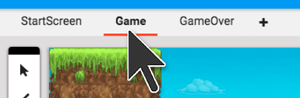

#Editing the Game level

We want to start off working on the **Game** level, but the current level open is the Start Screen level.

You can **switch to the Game level** by clicking on Game in the levels bar near the top of the screen. Now we can see our game world in this level.

##Moving around the level

We can only see a part of this level, since it is larger than our screen.

(instert gif)

To **move around the level** to see the rest of it, click on the **move tool** from the toolbar to the right of the sidebar, then click and drag on the level.

