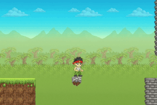

**Welcome to Gamefroot!**

In this tutorial you’ll learn the basics of Gamefroot by making a platform game using the Classic Template.

The **Gamefroot Classic Template** allows you to build onto a platform game template using the classic Gamefroot characters, terrain, and interactive game objects from the [Gamefroot Classic Pack](http://gamefroot.com/knowledgebase/using-the-gamefroot-classic-pack-to-make-your-own-platform-games./)