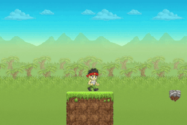

## Welcome to Gamefroot!

In this tutorial you’ll learn the basics of Gamefroot by making a platform game using the Classic Template.

The **Gamefroot Classic Template** allows you to build on to a platform game. This template uses Classic Gamefroot characters, terrain, and interactive objects.

Click **LET'S GO!** to begin.

[LET'](https://thornyd.gitbooks.io/gamefroot-basics-make-a-platform-game/content/open_the_gamefroot_classic_template.html)