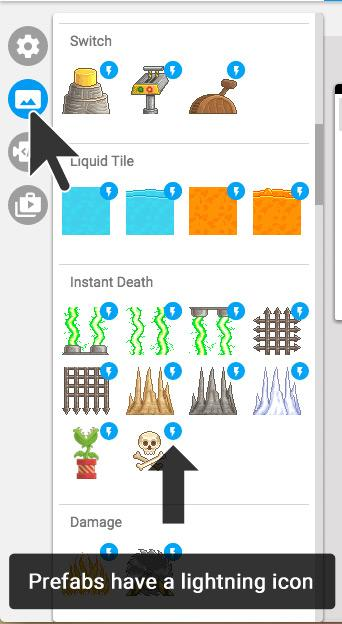

## Adding interactive Game Objects {#adding-interactive-game-objects}

This template game comes with a bunch of **interactive game objects** you can use, like characters, teleporters, story points, moving tiles, and doors. These have been programmed to behave in certain ways.

To view these, click on the **Game objects** tab in the sidebar (underneath the cog icon). To place them in your level, click on them, and then click inside your level.

(INSERT GIF HERE)

The game objects with lightning icons are the ones that have already some behaviours programmed into them – these are called **Prefabs** (short for pre-fabricated game object). For example the door is a prefab that has been programmed to open if the player walks up to it with a key.