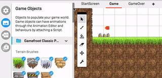

#Interactive Game Objects

There are a bunch of **interactive game objects** that you can use. Characters, teleporters, story points, moving tiles, and doors, are all avaiable in this template. These game objects have been programmed to behave in certain ways.

To see these, click on the **Game objects** tab in the sidebar. To place them in your level, click on one to select it, and then click inside your level to place it.

The game objects with **lightning icons** already have behaviors programmed into them. These are called **Prefabs** (short for pre-fabricated game object). For example, the **spikes** will instantly wipe out the player if they touch them.