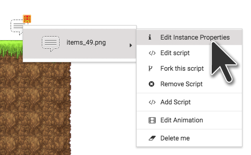
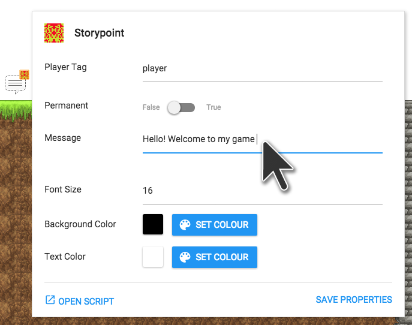

#Changing Properties of Game Objects

Different game objects will behave in different ways, and some of them will need you to tell them how to behave. For example, the **story point** is already programmed to display a message in your game when the player touches it. To customize that message, you need to open that game object’s **properties.**

**Right-click** on the game object and select **Edit Instance Properties.**

The **properties window** will pop up, and it will show you properties you can set for this game object. These properties will depend on the game object. 

Change the **Message** to make it say what you want to appear in your game. You can also change the color of the text, the color of the background, and the font size.

>Find out more about all [the different prefab game objects in the Gamefroot Classic Pack.](http://gamefroot.com/knowledgebase/#classic-prefabs)