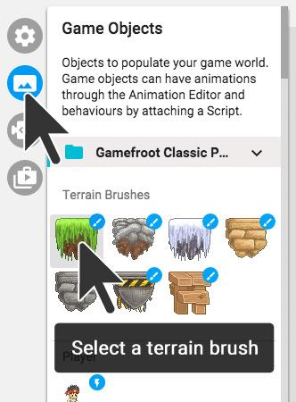
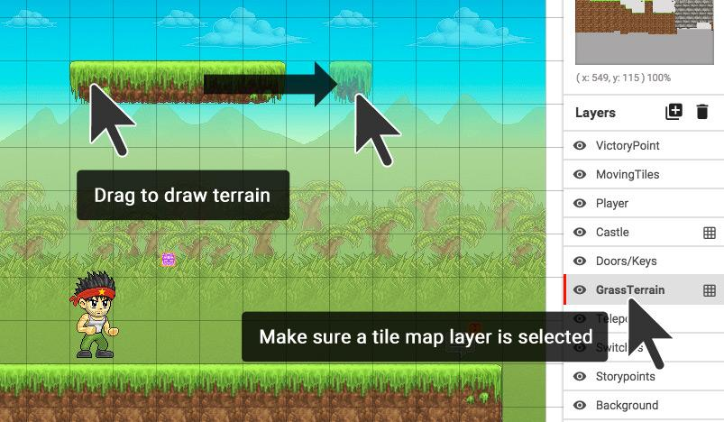

#Drawing terrain

Once you’ve seen what’s already in the level, we’re going to start adding some terrain.

Terrain is solid ground, walls, or platforms. It’s the stuff that you can walk on and bump into.

To draw terrain into your level, you must first select some terrain to use. Open the **Game Objects** sidebar (on the left), and click on a **terrain brush.** Now it is ready to paint into your level. (INSERT GIF HERE)

**Click and drag** inside your level to draw terrain. (INSERT GIF HERE)

Think about the way you’d like your world to be shaped, and draw it as best you can. Try using different kinds of terrain for different areas.

>If terrain doesn’t draw, you need to place it on a **tile map layer** (a tile map layer has a grid icon next to it). To do this, click on the GrassTerrain layer the Layers panel.

(INSERT GIF HERE)

Now any terrain that is placed in your level will go inside this layer. This helps you to organise the different things inside your level.