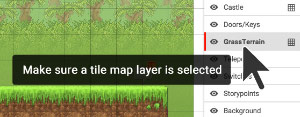

#Drawing terrain

Once you’ve seen what’s already in the level, we’re going to start adding some terrain.

Terrain is solid ground, walls, or platforms. It’s the stuff that you can walk on and bump into.

To draw terrain into your level, you must first select some terrain to use. Open the **Game Objects** sidebar, and click on a **terrain brush.** Now it is ready to paint into your level. 

**Click and drag** inside your level to draw terrain.

Think about the way you’d like your world to designed, and draw terrain to match that. Try using different kinds of terrain for different areas.

---

**Note:** If terrain doesn’t draw, you'll need to place it on a **tile map layer** (a tile map layer has a grid icon next to it). To do this, **click on the GrassTerrain layer** the** Layers** panel.

Now any terrain that is placed in your level will go inside this layer. Layers help you to organize the different things inside your level.