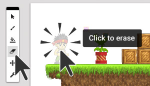

#Erasing things

Did you accidentally draw something in the wrong place? You can delete things in your level by switching to the **eraser tool** from the **toolbar.**

Click on the **eraser tool**, and then click on anything you want to delete.

To switch back to drawing, select the **brush tool** from the toolbar.

---

**Note:** You can only delete things **inside the currently selected layer**. We'll talk more about layers in the next couple of steps.