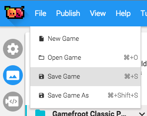

#Keep experimenting!

Try placing a few different game objects into your level, [see what properties they have for you to change,](http://gamefroot.com/knowledgebase/#classic-prefabs) and then play your game.

You may notice that some things need to be tweaked, so go back to edit mode, make the changes, and then play again. 

What parts of your game were the most fun? What parts can you improve?

## Make sure to save your game

As you add more to your game, remember to **Save** it often. In the menu bar up the top, click** File,** then **Save** to save your game.

When you’re happy with your game, [you can publish it to share it with the world!](http://gamefroot.com/knowledgebase/publishing-your-game-to-share-it-with-the-world/)