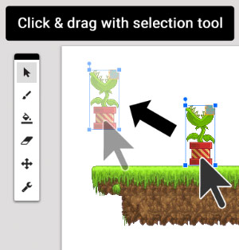

#Moving things

If you want to move something in your level without having to delete it and draw it again, you can use the **selection tool**.

Click on the selection tool from the toolbar, then click on something in your level to select it.

Your selected object should now have a border around it. **Click and drag ** the object to move it to a different position.