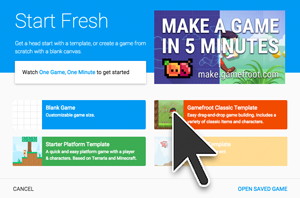

#Open the Gamefroot Classic Template 

Open the **Gamefroot Classic Template** by clicking on it from the Start Fresh window.

If you don't see that, you can open it by clicking **File, New Game** from the menu bar.

##Start by playing the game

Preview how the game looks by clicking **PLAY** in the top-right corner.

This game uses the arrow keys to move your character, and spacebar to jump.

As you’re playing the game, think about how you might improve it.

To return to editing the game, click **EDIT** in the top-right corner.