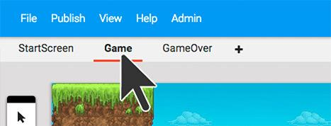

#Editing the Game level

We want to start off working on the **Game** level, but the current level open is the Start Screen level. (INSERT GIF HERE)

You can **switch to the Game level** by clicking on Game in the levels bar near the top of the screen. Now we can see our game world in this level.