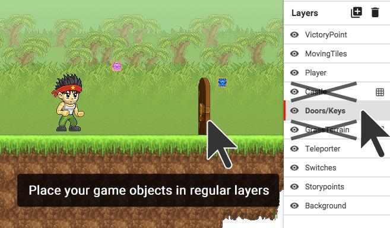

## Using Layers and Tile Maps for Game Objects and Terrain {#using-layers-and-tile-maps-for-game-objects-and-terrain}

If you place game objects in a tile map layer, they will be converted to be like terrain – this makes them solid and keeps them stuck in place. If we want our game objects to be able to do more than just sit there, we need to place them on a regular layer (not terrain/tile map).

>Note: Tile map layers have a grid icon to the right, and are crossed out in the image below.

(INSERT GIF HERE)

To do this, click on the one of the layers without a grid in the Layers panel. Now anything that is placed in your level will go inside this layer.

This helps you to organise the different things inside your level.

You can move layers in front of or behind each other by clicking and dragging on the layer in the layers panel.

(INSERT GIF HERE)

You can create a new layer by clicking the plus icon next to Layers, and you can delete a layer by clicking the trash can icon next to the plus icon.

(INSERT GIF HERE)

>Be careful, though – if you delete a layer, everything inside it will be deleted too.