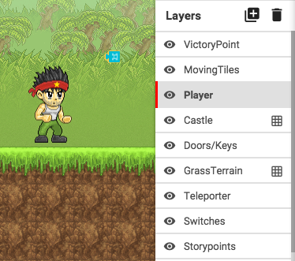
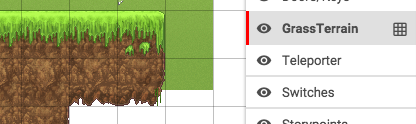
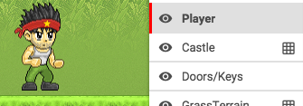
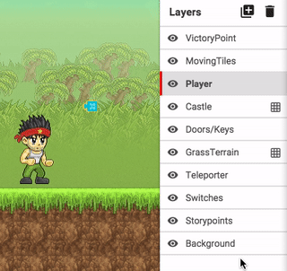
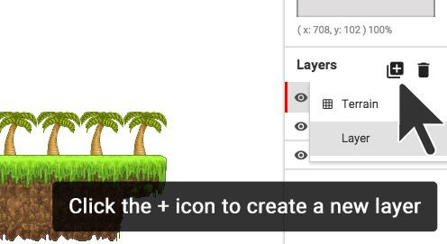

#Using Layers and Tile Maps

Layers can help you to organize the different things inside your level. You can see your layers in the **Layers panel** on the right.

Anything that is placed in your level will go **inside the currently selected layer.**

**To select** a tile map layer or a regular layer, **click on it** in the **Layers Panel**.

## Tile Maps

**Tile Maps** are for terrain. Anything placed in a tile map layer will become solid and stuck in one place. When a tile map is selected, you can see a **grid** in your level, and a small **grid icon** next to the tile map in the **Layers** panel.

##Layers

Regular **layers** are for game objects like characters and interactive objects that need to be able to move around and do things. 

---

##Reordering layers

You can **move layers in front of or behind each other** by clicking and dragging on the layer in the layers panel.

---

##Creating and deleting layers

You can **create a new layer or tilemap** by clicking the **+ ** button next to **Layers.** 

You can **delete a layer or tile map** by clicking the **trash can** button next to the** + **button. **Be careful:** if you delete a layer, everything inside it will be deleted.